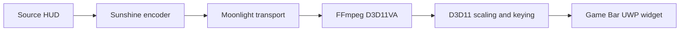

# Software Fuser

[](https://github.com/xDeploymentSock/XboxGameBarMixer/actions/workflows/core-checks.yml)

Overlay a remote PC's HUD on your local display with a transparent, pinned Xbox Game Bar widget. Sunshine supplies the video; Software Fuser decodes it on the GPU and removes a reserved background color. Mouse and keyboard input stay on the local PC.

**Installed baseline: 0.2.1.8.** It reuses decoder packet/receive wrappers and transfers frame references while preserving color rendering and output leases. Native checks and both widget builds pass; local Release installation is verified with Windows package status OK and an executable matching the tested build. Reduced allocations are measured, but a live latency or displayed-FPS gain is not established. See the [changelog](CHANGELOG.md) for version changes and [validation](docs/VALIDATION.md) for measured results.

**Prepared diagnostic candidate: 0.2.1.9.** It separates decoder, presentation-wait, draw and Present CPU timings, records worker activity at the first transport queue overflow and provides a summary tool for matching private timing checkpoints. Debug/Release packages are built and checked locally; the candidate is uninstalled and its live behavior/performance remains unverified. See [candidate validation](docs/VALIDATION.md#in-process-timing-candidate).

## Features

- Sunshine PIN pairing, saved protected credentials and application selection.
- View-only H.264/HEVC streaming with hardware decoding.
- Black, green and magenta background removal. **Remove black only** preserves surviving decoded colors with opaque alpha.
- Pinned, transparent video with Game Bar's user-controlled click-through.
- Whole-feed fitting above an adjustable taskbar reservation, Smooth/Crisp HUD scaling and manual widget dimensions.
- Connect, HUD, Layout and Details views with saved profiles and stage-specific stream statistics.

## Getting started

The receiver needs **Windows 11 x64**, Xbox Game Bar and a GPU supporting D3D11 hardware decoding. Configure Sunshine on the source PC and connect both PCs over wired LAN.

Build the local development package from a Windows checkout using Visual Studio 2022, v143 C++, UWP C++ tools and Windows SDK 10.0.26100.0:

```powershell
.\tools\Build.ps1 -Target Widget -Configuration Release
.\tools\Deploy.ps1 -Configuration Release
```

The build restores pinned dependencies and creates an unsigned development MSIX. Deployment is explicit, closes an existing Software Fuser process and requests Windows elevation. The [build guide](docs/BUILD-LATER.md) covers prerequisites, package verification and troubleshooting.

1. Press **Win+G** and open **Software Fuser** from the widget menu.
2. On **Connect**, enter the Sunshine hostname/IP, click **Pair with Sunshine**, and enter the displayed PIN on Sunshine's PIN page.
3. Click **Refresh apps**, select **Desktop** or the intended application, then **Connect**. Another active Sunshine application is preserved; conflicts are reported.
4. On **HUD**, select the source background and apply its key settings. For natural retained colors on black, click **Remove black only**. **Remove near-black noise** also deletes very dark pixels.
5. On **Layout**, click **Apply video fit** and adjust the taskbar reservation. The complete feed fills the usable area, allowing slight vertical compression.
6. Pin the widget, enable Game Bar click-through, and close Game Bar. Use **Disconnect** to stop this client's stream.

Pairing survives package updates. For sharp text, try **Crisp HUD** scaling. **Draw test pattern** is a local preview; it submits one frame. See the [menu guide](docs/WIDGET-MENU.md) for the remaining controls.

## Architecture and technology



The client uses **C++20, C++/WinRT, XAML and D3D11**. A latest-frame mailbox bounds the decoded-frame queue; video stays inside the Game Bar UWP composition surface. Audio playback and remote input forwarding are disabled. [Architecture](docs/ARCHITECTURE.md) documents ownership and shutdown; the [build guide](docs/BUILD-LATER.md) and [dependency lock](native/dependencies/source-lock.json) record pinned dependencies.

## Current limits

The target is **2560 x 1440 at 240 requested FPS**. Live pipeline measurements exceeded the accepted 200 FPS milestone; 240 distinct displayed source frames and capture-to-screen latency remain unproven. Receive/decode/Present rates measure different pipeline stages.

Game Bar may constrain widget size and position. Main fits the feed above the taskbar; automatic simultaneous top-edge/taskbar coverage remains unresolved. **Fit my monitor**, **Apply dimensions** and **Reset widget position** are explicit actions. Manual placement may be needed.

Rendering currently supports SDR 8-bit NV12. HDR/P010 and 4:4:4 rendering remain future work. Compression, chroma subsampling and scaling can affect text edges before keying. Black removal preserves decoded RGB; video follows Game Bar opacity only when explicitly enabled in HUD fine tuning.

## Development and testing

Portable checks need CMake 3.24+, a C++20 compiler, Git and Python 3.10+:

```text
python tools/audit_repository.py
python -m unittest discover -s tests -p timing_summary_tests.py
cmake -S . -B build/core -DFUSER_BUILD_TESTS=ON -DCMAKE_BUILD_TYPE=Release
cmake --build build/core --config Release
ctest --test-dir build/core -C Release --output-on-failure
```

CI runs these CPU-only checks on Windows and Linux. UWP compilation, GPU/decoder tests and live compositor checks use the separate [Windows procedures](docs/BUILD-LATER.md).

Keep work scoped to the intended branch: main contains usable-area fitting; a separate testing branch investigates host coverage. Follow modern C++ ownership practices, preserve bounded queues and record verification before claiming a fix. See [contributing](CONTRIBUTING.md) for checkpoint review, staging and publication checks.

## Project structure

| Path | Purpose |
| --- | --- |
| `native/widget` | Game Bar package, C++/WinRT shell and XAML settings |
| `native/core` | Portable configuration, frame contracts and mailbox |
| `native/windows` / `native/shaders` | Hardware decoding and GPU rendering |
| `native/streaming` | Sunshine control and stream orchestration |
| `tests` | Source HUD and core/GPU/decoder/control fixtures |
| `tools` / `docs` | Build, deployment, measurement and documentation |

## Documentation

| Topic | Guide |
| --- | --- |
| Installation and controls | [Build guide](docs/BUILD-LATER.md), [widget menu](docs/WIDGET-MENU.md) |
| Image quality and placement | [Black removal](docs/BLACK-CLEANUP.md), [video fit](docs/VIDEO-FIT.md), [HUD quality/latency](docs/HUD-QUALITY-LATENCY.md) |
| Connection and performance | [Desktop selection](docs/DESKTOP-LAUNCH.md), [receiver performance](docs/RECEIVER-PERFORMANCE.md), [code review](docs/CODE-REVIEW.md) |
| Status and history | [Validation](docs/VALIDATION.md), [roadmap](docs/ROADMAP.md), [changelog](CHANGELOG.md), [development history](docs/DEVELOPMENT-HISTORY.md) |
| Repository maintenance | [Contributing](CONTRIBUTING.md), [skills](docs/REPOSITORY-SKILLS.md), [upstream references](docs/REFERENCES.md) |

## Privacy and licensing

Private host addresses, credentials, captures, certificates, runtime logs and generated packages stay out of Git. Pairing credentials use protected app-local storage. The repository audit checks common accidental publication patterns; review the diff before pushing.

No root distribution license has been selected for project code. Dependency copyright and license notices are retained in `third_party/licenses` and [third-party notices](THIRD-PARTY-NOTICES.md).
