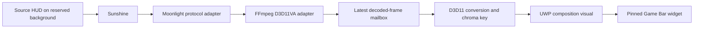

# Architecture

## Agreed behavior

The source PC renders HUD content on a reserved black, green or magenta background. Sunshine captures and encodes that display. A Windows 11 Game Bar widget receives the stream, decodes into GPU memory, removes the reserved background, and presents a premultiplied-alpha surface. Input stays on the local PC through Game Bar's user-controlled click-through setting. Audio and remote input forwarding are outside this first implementation.

240 is a requested stream rate, not a claim about displayed FPS or synchronized scanout. The monitor, source generation, capture, encoder, transport, decoder, renderer, and compositor must each be measured. No implementation may silently substitute a lower rate and label it 240 FPS.

## Components and interfaces

- `sunshine_control`: explicit pairing, protected own-client credentials, certificate-pinned HTTPS, application enumeration, and launch/resume. No networking on widget activation. An existing different source app is preserved.
- `overlay_session`: owns Moonlight's process-wide callback core, hardware decoder, mailbox, and presentation worker. Setup/stop run on a serialized MTA owner worker; the UI can cancel, request resize, or sample counters. No user input is forwarded, and the core's startup mouse wake-up is removed in an isolated build copy. Audio callbacks consume packets without playback.
- `stream_client`: retained portable design interface; the concrete session owns codec setup callbacks directly so initialization follows actual Moonlight format negotiation.
- `video_decoder`: explicit initialization and ordered compressed submissions. The implementation creates FFmpeg hardware frames on the renderer's D3D11 device and returns a leased GPU surface.
- `encoded_frame`: owns compressed bytes and a local receive timestamp. Host timestamps are optional and cannot be subtracted from local timestamps without a measured clock conversion.
- `decoded_frame`: owns a shared GPU surface and records dimensions, codec color metadata, sequence, receive time, and decode completion time.
- `latest_frame_mailbox`: retains at most one waiting decoded frame. Replacement is separately counted and releases the displaced surface outside the mutex. Compressed reference frames never go through this mailbox.
- `d3d11_surface`: owns a COM texture reference and optionally a decoder frame lease. FFmpeg pooled textures require the lease; standalone GPU copies do not.
- `d3d11_renderer`: owns the D3D11 device/context, composition swap chain, shaders, and up to three in-flight frame leases. Event queries release those leases after GPU reads finish. `present_calls` counts application submissions only.

Setup order: configure -> create renderer -> pair/enumerate/choose source application -> launch/resume via authenticated control -> Moonlight negotiation -> initialize actual decoder format on the renderer device -> ordered decode -> mailbox -> render/present. Failed compressed submissions request an IDR; unsupported pixel formats terminate the session. On teardown, join Moonlight callbacks and the render worker before stopping the decoder and closing/resetting the mailbox. The retained widget renderer may still own leases for completed/queued GPU reads.

## Rendering and ownership

The current shader performs SDR NV12 conversion using BT.601/BT.709 and explicit full/limited range, followed by key tolerance, edge softness, spill suppression, and premultiplication. HDR/P010 and 4:4:4 are declared in the wider contracts but not implemented by this renderer. Codec preferences are requests until negotiation supplies an actual format.

During streaming, resize/draw/present belong to the render worker. FFmpeg's hardware callbacks share the renderer's recursive immediate-context lock. DXGI Present takes that same lock: concurrent Present and hardware context calls reproduced a HEVC deadlock and a d3d11.dll access violation. See [validation results](VALIDATION.md). The UI queues resize requests and cannot draw a diagnostic frame until disconnected. Production uses shader-readable decoder textures; tests alone read pixels back to the CPU.

The renderer samples an even, in-bounds visible rectangle within a shader-readable NV12 allocation. Per-plane UV clamping prevents allocation padding from bleeding into visible edges; the crop path is covered by GPU tests. Decoder-only textures still need a tested GPU-copy fallback if a driver rejects combined decoder/shader-resource binding. Retain the AVFrame/AVBufferRef lease for pooled output until the GPU event query completes. FFmpeg's D3D11 lock/unlock callbacks must share the renderer's recursive context lock.

The shell connects a `CreateSwapChainForComposition` swap chain through `ICompositorInterop::CreateCompositionSurfaceForSwapChain` and a UWP composition `SpriteVisual`. It accounts for raw-pixel/view-pixel scale when sizing GPU buffers. The monitor-size request changes the widget window only; it does not change the monitor resolution or refresh rate. Game Bar can refuse or constrain that request.

## Startup, shutdown, and limitations

Initial activation shows settings and performs no GPU allocation or remote connection. Drawing a diagnostic frame is an explicit action. Game Bar repeat activation retains the first widget connection. Pinned-only mode hides controls. The installed runtime reports RequestedOpacity as 1.0 in foreground and 0.85 when pinned, despite API prose saying 0-100. The settings card follows that host opacity. Video stays opaque by default and follows it only when explicitly enabled in Advanced. Black-removal presets keep surviving decoded colors opaque.

Close/suspend cancels the current action. Suspension retains the Game Bar host; resume rebuilds an idle settings page and never reconnects automatically. Generation checks reject stale or duplicate resume notifications. See [menu recovery](MENU-RECOVERY.md) for verification limits. Stream shutdown joins workers before a new session can acquire the core, preventing callbacks from entering a later connection. Device/presentation errors are terminal and require reconnect. Visibility, DPI changes without logical resizing, and monitor transitions need live validation; add handling where evidence requires it. Rendering drains its leased GPU reads before destruction; measure shutdown under device removal.

Exact screen-edge coverage, actual 240 displayed FPS, fullscreen Vulkan/OpenGL behavior, and local-game performance cost are unverified. If Game Bar is the demonstrated blocker, record the evidence and discuss a desktop overlay alternative with the user before changing the chosen platform.
